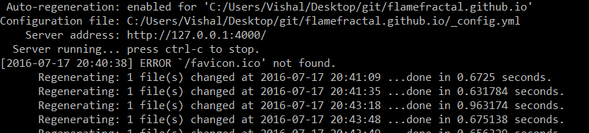

To set up local development of an existing Jekyll blog,

1. **Install Ruby**

		Using Homebrew on OSX, or download package from the web for Linux/Windows.
2. **Install Jekyll** 

		gem install jekyll.
3. **Install dependancies**. 

		eg. gem install jekyll-paginate &
			gem install jemoji.
4. Navigate to your site's root directory and `jekyll serve`.
5. Head to the web browser and enter URL: `http://127.0.0.1:4000`.

_**The best part is that every change to a file locally will be regenerated automatically. This allows for fast development.**_

