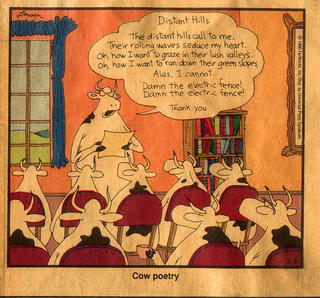

As I'm doing a Poetry Appreciation course this semester, I really relate to this person's thoughts after the first couple of lectures.

[Why I Hate Poetry](http://michiedo.blogspot.in/2008/05/why-i-hate-poetry.html)

Some snippets from the post :

>	 I hate that with poetry, we are expected to read into it all. 

>	With poetry, you’re given basically nothing, and you’re expected to identify facts that you would have absolutely no way of knowing. It’s ridiculous.

>	I do think poetry is occasionally respectable. I guess, I’m in favor of the privatization of poetry. 

I can understand how dissecting poetry can help us create symbolism, and watch for subtleties in writing. I can also see how poetry can sometimes be fun. I like some poetry, when I make it mean something new to me instead of trying to guess why the author wrote it. I do also enjoy the challenge of creating poems with particular rhythms. I like funny poetry. I think that some poems are kind of like a collage of senses; they can combine smells and imagery and those sorts of things, and that’s kind of interesting and even occasionally powerful.

Generally, though, I think poetry tends to be a big game of “Guess what I’m thinking!” and I hate that game. I’m not a mind-reader. I think a lot of people who get excited about poetry are really pretentious

---
